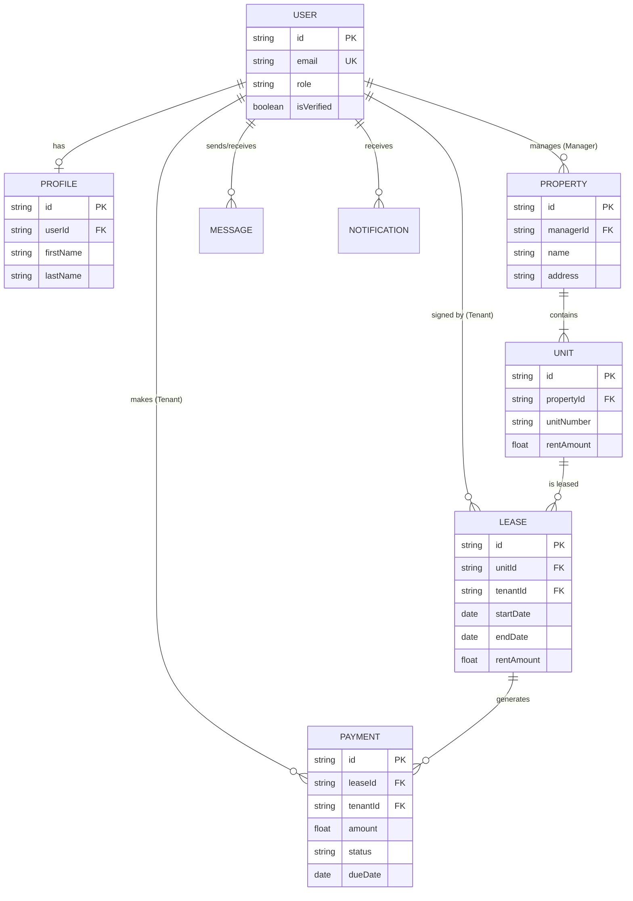

# TenantEase Project Documentation

**Version:** 1.0.0 (Production Ready)  
**Year:** 2026  
**Developers:** Tina Rathore & Bhavya Bindal

---

## 🚀 Project Overview
TenantEase is a premium property management platform designed to streamline the relationship between landlords/managers and tenants. It provides a full-stack solution for property listing, tenant management, automated payment tracking, and real-time communication.

---

## 💻 Frontend Architecture
Built with modern React standards, the frontend focuses on performance, accessibility, and high-end aesthetics.

- **Framework:** React with Vite for lightning-fast development.
- **Language:** TypeScript for type safety and robust code.
- **Styling:** Vanilla CSS + Tailwind CSS utilities for a "Glassmorphism" and modern UI.
- **State Management:** Zustand for lightweight and fast global state.
- **Routing:** React Router DOM with Lazy Loading for optimized bundle sizes.
- **API Client:** Axios with interceptors for JWT session management.

---

## ⚙️ Backend Architecture
The backend is a robust Node.js Express server designed for scalability and security.

- **Runtime:** Node.js with Express.js framework.
- **Language:** TypeScript.
- **Database ORM:** Prisma for type-safe database queries.
- **Authentication:** JWT (JSON Web Tokens) with secure password hashing (Bcrypt).
- **Validation:** Zod for runtime schema validation.
- **Security:** Role-Based Access Control (RBAC) middleware for Manager and Tenant permissions.

---

## 📊 Database & ERD
The system uses a relational database structure, currently running on **SQLite** for development and configured for **PostgreSQL (Supabase)** for production.

### Entity Relationship Diagram (ERD)

---

## ✨ Key Features
- **Manager Dashboard:** Real-time analytics on revenue, occupancy, and pending tasks.
- **Tenant Portal:** View lease details, pay rent online, and update profile information.
- **Unified Messaging:** Direct chat between managers and tenants for maintenance and queries.
- **Automated Payments:** Tracks payment statuses (Pending, Completed, Overdue) automatically.

---
© 2026 TenantEase - Tina Rathore & Bhavya Bindal. All rights reserved.
