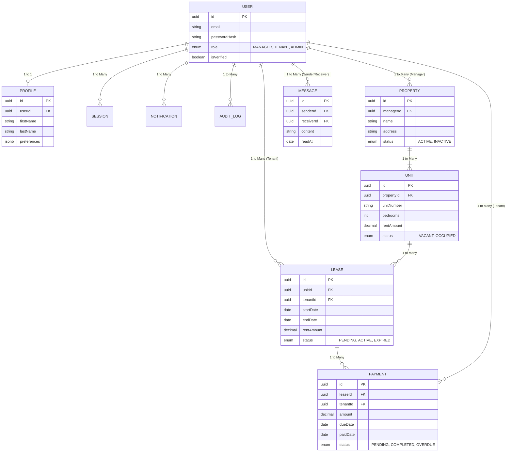

# TenantEase Entity Relationship Diagram (ERD)

Here is the visual representation of the PostgreSQL database schema we built. You can use this for your presentation or documentation.

### Understanding the Relationships

1. **User Role Separation**: The `USER` table handles both Managers and Tenants. A Manager is linked to `PROPERTY`, while a Tenant is linked directly to a `LEASE`.
2. **Junction Table**: The `LEASE` table acts as a bridge connecting a `UNIT` to a `USER` (Tenant).
3. **Double Link**: The `PAYMENT` table is linked to both the `LEASE` and the `USER` (Tenant). This is an optimization choice so managers can easily pull all payments by a specific tenant without performing a complex JOIN through the lease table.
